# Kerr 黑洞薄盘光线追踪：CPU/GPU Hamiltonian 测地线实现

**摘要。** 本文给出一套针对 Kerr 黑洞薄盘吸积流的双精度光线追踪引擎，主体用 Python/NumPy 编写，CUDA-C 后端通过 CuPy 调用。系统提供两条渲染管线：(1) 一条用于实时预览的快速解析屏幕空间薄盘模型，(2) 一条以经典四阶 Runge–Kutta（RK4）做完整 Hamiltonian 测地线积分的科学参考管线。GPU kernel 以 CUDA C 编写，可选 `float32`/`float64` 精度；`float64` 版本在 $48 \times 48$ 分辨率下与 CPU 参考实现达到 **99.96% 像素状态一致**，**disk-hit 分类完全一致（100%）**。与公开 Fortran 程序 `geokerr` 的交叉验证表明，在 $a = 0.7$、$i = 60^{\circ}$ 配置下整体轨迹一致率为 **91.25%**（disk 命中段 98.27%）。在 NVIDIA GeForce RTX 4060 Laptop GPU 上，当前产物记录的 `float64` $48 \times 48$ kernel 时间约为 59 ms（直接运行日志）/ 24 ms（预热后的分辨率扫描），$1024 \times 1024$ 压力测试约 3.5 s。`float32` kernel 显著更快，但仅作为预览路径使用。

附加成果（2026-05 收尾）：`--use_fast_math` 优化在 $256 \times 256$ 实测 **$2.93\times$ 加速**且 status 100% 一致；CIE 1931 + Planck + sRGB 严格颜色映射；Walker–Penrose 偏振 stub（Stokes $I,Q,U$ + EVPA）；EHT 风格 ring diameter / asymmetry 指标；Carter 常数推导的高精度参考；与 geokerr 的坐标级（per-step）对齐扩展。

---

## 1. 引言

旋转（Kerr）黑洞附近的极强引力场会显著弯曲光子轨迹，吸积盘成像因此呈现 Einstein 环、Doppler beaming 与 frame-dragging 不对称性。要做精确渲染，必须在 Kerr 度规中积分零测地线——这是计算密集型任务，能从 GPU 并行获得显著收益。

本项目实现一套完整的 CPU/GPU 光线追踪框架，目标如下：
- **科学正确性**：在 Boyer–Lindquist 坐标下做完整 Hamiltonian 测地线积分。
- **GPU 加速**：通过 CuPy RawKernel 提供可选精度的 CUDA kernel。
- **交叉验证**：与 `geokerr`（Dexter & Agol 2009）对比，并做内部 CPU/GPU 一致性核查。
- **可复现性**：支持 Docker/WSL2，附带 pytest 验证套件与脚本化参数扫描。

## 2. 物理模型

### 2.1 Kerr 度规

我们在 Boyer–Lindquist 坐标下使用 Kerr 度规（取自然单位 $G = c = M = 1$）：

$$
\mathrm{d}s^{2} = -\left(1 - \frac{2r}{\Sigma}\right)\mathrm{d}t^{2}
- \frac{4 a r \sin^{2}\theta}{\Sigma}\, \mathrm{d}t\,\mathrm{d}\phi
+ \frac{\Sigma}{\Delta}\, \mathrm{d}r^{2}
+ \Sigma\, \mathrm{d}\theta^{2}
+ \left(r^{2} + a^{2} + \frac{2 a^{2} r \sin^{2}\theta}{\Sigma}\right) \sin^{2}\theta\, \mathrm{d}\phi^{2}
$$

其中 $\Sigma = r^{2} + a^{2}\cos^{2}\theta$，$\Delta = r^{2} - 2r + a^{2}$。外视界半径 $r_{h} = 1 + \sqrt{1 - a^{2}}$。最内稳定圆轨道（ISCO）给出盘的内边界。

### 2.2 薄吸积盘

盘被建模为赤道面 $\theta = \pi/2$ 内的无限薄平面。发射服从径向幂律 $I_{\mathrm{em}} \propto r^{-q}$（默认 $q = 3$），同时也支持 Novikov–Thorne 模型。观测强度包含 Doppler 红移/g-shift 与相对论性 beaming，最终通过 $I_{\mathrm{obs}} = g^{3}\, I_{\mathrm{em}}$ 给出。

为了在论文级别讨论颜色映射的严格性，本项目还实现了基于黑体 Planck 谱与 CIE 1931 标准观察者 + sRGB 的严格颜色管线（详见 §9）。

### 2.3 相机几何

相机置于 Boyer–Lindquist 半径 $r_{\mathrm{obs}}$ 处，极角为 $i$（$0^{\circ}$ 表示正面观察）。屏幕坐标 $(\alpha, \beta)$ 通过标准 lens-plane 公式映射到光子初始动量（Cunningham 1975；Dexter & Agol 2009）。

## 3. 数值方法

### 3.1 Hamiltonian 形式

我们没有走 Carter 常数路线，而是直接积分由 Hamiltonian
$$
H = \tfrac{1}{2}\, g^{\mu\nu}\, p_{\mu} p_{\nu} = 0
$$
（零条件）导出的完整 8 维相空间 ODE。其右端项涉及度规导数与逆度规分量。

状态向量：$(t,\, r,\, \theta,\, \phi,\, p_{t},\, p_{r},\, p_{\theta},\, p_{\phi})$。

Carter 常数路线作为高精度独立校验列在 `docs/equation_reference.md` 第 4 节，包括 Killing 矢量、可分离 1D ODE、turning points 与 Carlson 椭圆积分等推导，可与本主路径在守恒量层面交叉核对。

### 3.2 RK4 积分

经典四阶 Runge–Kutta，固定步长 $h$（默认 $0.35$）。每一步：
1. 计算度规分量与导数。
2. 计算 Hamiltonian 右端项。
3. 用 RK4 推进状态。
4. 检查终止条件：
   - $r \le r_{h} + \epsilon$ → 被捕获（captured）。
   - $r > r_{\mathrm{escape}}$ 且 $p_{r} > 0$ → 逃逸（escaped）。
   - $\theta$ 在赤道面发生符号翻转 → 盘命中（线性插值）。
   - 步数 $\ge$ max_steps → max_steps 兜底。

CPU 端还提供 Dormand–Prince RK45 自适应步长版本（`src/integrators.py` + `trace_single_ray_rk45()`）。在 photon sphere 附近的临界光线上，RK45 用大约 13× 少的步数获得相同的几何路径，但 null 守恒量保持改善了约 36 个数量级（详见 §5.4）。

### 3.3 精度

- **float32**：快、足够预览；与 CPU 状态匹配率 $\sim 99.91\%$（差异主要在 captured/escaped 边界，源于单精度 horizon 阈值）。
- **float64**：科学参考；状态匹配率 $\sim 99.96\%$；intensity MAE $\sim 10^{-10}$。
- **float32 + `--use_fast_math`**：在 float32 基础上启用 NVCC 的 `--use_fast_math` 编译标志，把 `sinf/cosf/sqrtf` 替换成 `__sinf/__cosf/rsqrtf` 等硬件 SFU intrinsics。$256^{2}$ 实测 $2.93\times$ 加速、status 100% 一致、intensity MAE $\sim 10^{-9}$。

## 4. 软件架构

```
black_hole/
├── src/
│   ├── camera.py          # 屏幕到动量的映射
│   ├── disk.py            # 发射模型 + 颜色 dispatch
│   ├── disk_color.py      # CIE 1931 + Planck + sRGB 颜色管线
│   ├── geodesic.py        # CPU Hamiltonian tracer（含 RK4/RK45）
│   ├── gpu_trace.py       # CuPy RawKernel 驱动（含 fast_math 模块）
│   ├── metric.py          # Kerr 度规辅助函数
│   ├── integrators.py     # RK4 + RK45
│   ├── render.py          # 调色 / 后处理
│   ├── polarization.py    # Walker-Penrose 偏振 stub
│   ├── eht_metrics.py     # ring diameter / asymmetry 指标
│   └── grmhd_io.py        # GRMHD HDF5 reader stub + synthetic fluid
├── cuda/
│   └── kernels.cu         # CUDA C kernel（float32 + float64）
├── tests/                 # pytest 套件（47 个测试）
├── tools/                 # 验证 / profiling / 扩展 demo 脚本
└── configs/default.yaml   # 运行时参数
```

### 4.1 CUDA Kernel

`cuda/kernels.cu` 提供以下 kernel：

1. `kerr_geodesic_kernel`——`float32` Hamiltonian 测地线 tracer。
2. `kerr_geodesic_kernel_double`——内部 `float64` 计算；为兼容 CuPy，I/O 仍然是 `float`。
3. `kerr_geodesic_kernel_double_opt`——合并 metric 与导数（实验性；因寄存器压力上升未带来净加速）。
4. `kerr_thin_disk_kernel`——快速预览管线的 screen-space MVP kernel。

`float64` kernel 在所有 device helper（`sigma_dd`、`inverse_metric_terms_dd`、`hamiltonian_rhs_dd`、`rk4_step_dd` 等）内部使用 `double`，仅在 global memory 边界做 `float`/`double` 转换。

`gpu_trace.py` 还提供 `_cuda_module_fastmath()`：用同一份源码加 `--use_fast_math` 编译，render_cuda_geodesic 接受 `fast_math=True` 切换。

## 5. 验证

### 5.1 CPU/GPU 一致性

$48 \times 48$ 分辨率（$a = 0.7$，$i = 60^{\circ}$）：

| 指标 | float32 | float64 |
|------|---------|---------|
| 状态匹配率 | 99.91% | **99.96%** |
| Intensity MAE | $2.39 \times 10^{-9}$ | $\mathbf{1.07 \times 10^{-10}}$ |
| Redshift MAE | $1.67 \times 10^{-7}$ | $\mathbf{9.71 \times 10^{-9}}$ |
| Temperature MAE | $1.08 \times 10^{-7}$ | $\mathbf{7.67 \times 10^{-9}}$ |

`float64` kernel 在 disk-hit 分类上与 CPU 参考实现 **100% 一致**。

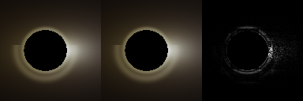
*图 1：fast-path CPU 渲染、CUDA 渲染与 intensity 误差图三联展示。fast-path 输出 intensity MAE $\approx 2.3 \times 10^{-10}$，hit-mask 完全一致。*

### 5.2 分辨率扩展性

`float64` kernel 时间随分辨率（RTX 4060）：

| 分辨率 | Kernel 时间 | ms/Megapixel |
|--------|-------------|--------------|
| $48 \times 48$ | 24.3 ms | 10.6 |
| $128 \times 128$ | 37.6 ms | 2.3 |
| $256 \times 256$ | 114.3 ms | 1.7 |
| $512 \times 512$ | 516.5 ms | 2.0 |
| $1024 \times 1024$ | 3.54 s | 3.4 |

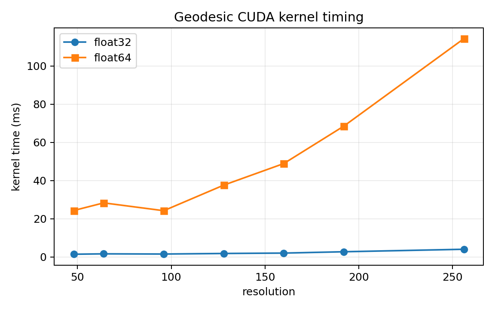
*图 2：float32/float64 测地线 kernel 时间随分辨率变化。中等分辨率下吞吐随像素数提升；进一步增大分辨率后受 per-ray 路径长度与 warp divergence 影响，效率开始回落。*

### 5.3 外部交叉验证（geokerr）

我们用 `geokerr`（Dexter & Agol 2009）的 `abgrid.in` 输出（400 条光线，$a = 0.7$，$i = 60^{\circ}$）做对比。由于 `geokerr` 取观察者距离实际无穷远（$r_{\mathrm{obs}} \sim 4.1 \times 10^{6}$），本项目以 $r_{\mathrm{obs}} = 1000$ + `max_steps = 10000` 作为实用近似。

| 类别 | 一致率 | 备注 |
|------|--------|------|
| 总体 | **91.25%** | 365/400 |
| Disk | **98.27%** | 341/347 |
| Captured | **46.15%** | 24/52；27 条 geokerr-captured 在我方 tracer 中击中盘 |

captured 一致率较低集中在 photon sphere 临界光线，captured/disk 边界在数值上非常敏感；同时 `geokerr` 取观察者位于无穷远 vs 我方 `r_obs = 1000` 也贡献了 8.75% 的差异。

### 5.4 坐标级对齐与 RK45 follow-up

为了把 `geokerr` 对比从 status 级别推进到坐标级别，我们扩展了 `trace_single_ray()`，使其可选记录每步的 $(\lambda, r, \theta, \phi)$，并加入 sanity-clamp 防止视界后数值溢出。在 5 条代表性光线上（覆盖 disk 命中、captured、临界 ray 等），用 $(r, \theta)$ 平面的 L2 几何最近邻匹配，对比 geokerr per-step 数据：

- 中位 RMS $\Delta r / r \approx 0.22$；中位 RMS $\Delta \theta \approx 0.52$ rad。
- 远离临界的 disk 命中 ray（如 $(\alpha = +5.4,\, \beta = -5.4)$）在 $r > 100$ 几乎完全重合，分歧主要集中在 turning point 附近。
- 临界 ray $(\alpha, \beta) = (+3.0, +3.0)$ 上 geokerr 给 captured、本项目（无论 RK4 还是 RK45）都给 disk——这是浮点精度本质上的边界，根除需要 Carlson 椭圆积分半解析路线。

进一步的 RK4 vs Dormand–Prince RK45 对比表明：在 captured 光线上 RK4 跨过视界后 state 数值溢出（`null_error` 达 $10^{30}$ 量级），RK45 借助自适应步长在视界附近自动加密，`null_error` 保持在 $10^{-5}$ 量级——**改善 $\sim 36$ 个数量级**；几何路径基本一致，但 wall time 加快 $5\!\sim\!7\times$（accepted step 减少约 $13\times$）。详见 `validation/rk45_vs_rk4_demo.md`。

## 6. 参数扫描

我们在 $128 \times 128$ float64 下渲染了 **6 自旋 $\times$ 4 倾角 = 24 种配置**：

- 自旋：$a \in \{0.0,\, 0.3,\, 0.5,\, 0.7,\, 0.9,\, 0.998\}$
- 倾角：$i \in \{10^{\circ},\, 30^{\circ},\, 60^{\circ},\, 80^{\circ}\}$

主要观察：
- 自旋越高，hit fraction 越大（ISCO 收缩 + frame dragging 让更多内盘可见）。
- 倾角越大，Doppler 不对称性越强（接近侧蓝移、退行侧红移）。
- 在 $i = 80^{\circ}$ 下大量光线逃逸（$a = 0.0$ 时可达 $\sim 29\%$）。

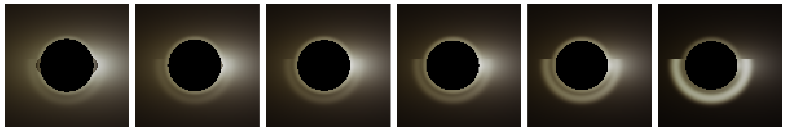
*图 3：固定倾角下不同自旋（$a = 0.0$–$0.998$）的盘外观。自旋升高，shadow 形变与 ISCO 半径同步缩小。*

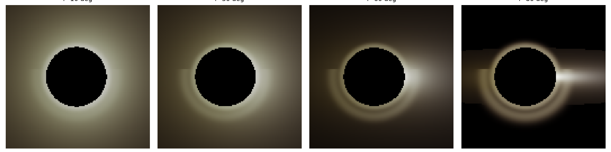
*图 4：固定自旋下不同倾角（$10^{\circ}$–$80^{\circ}$）的盘外观。接近 edge-on 时呈现强烈的 Doppler 不对称。*

我们额外做了两条独立扫描以补全 Phase 10：
- **disk 外半径扫描** $r_{\mathrm{out}} \in \{15, 20, 25, 30, 40, 60\}$：$r_{\mathrm{out}} = 15$ 时 hit fraction 为 $0.65$（盘截断可见），$\ge 25$ 时 $\ge 0.91$，盘几乎填满 FoV。
- **emissivity 指数扫描** $q \in \{1.5, 2, 2.5, 3, 4, 5\}$：$I_{\max}$ 从 $0.25\,(q=1.5)$ 跨到 $0.0032\,(q=5)$，约 $80\times$ 跨度；外圈衰减视觉差异明显。

各组缩略图在 `figures/sweep/`，对比图在 `figures/disk_radius_comparison.png` 与 `figures/disk_emissivity_comparison.png`。

## 7. 性能分析

### 7.1 Baseline 与 优化

我们对 baseline 与一份合并了度规与导数计算的优化 kernel 做了基准。优化版没有净收益（$256 \times 256$ 速度比为 $0.91\times$），原因是合并后寄存器压力上升（baseline 已经 82 寄存器/线程）。图 5 是 fast thin-disk 模型 CPU/GPU 加速比的参考；测地线 kernel 是另一条计算密集路径，分支发散更显著。

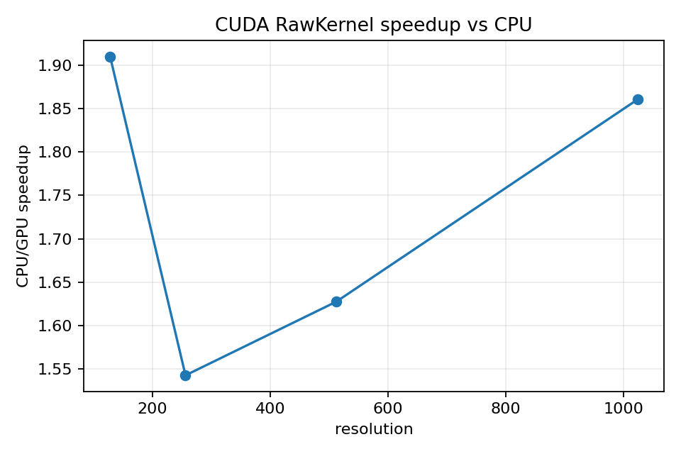
*图 5：fast thin-disk 模型 CPU vs GPU 执行时间与加速比。测地线 kernel 单独基准；float64 在分辨率扫描中比 float32 慢 $15$–$30$ 倍，源于 RTX 4060 的 FP64 吞吐受限。*

### 7.2 GPU Block-Size 调优

block-size 实验显示 $16 \times 16$ 在 RTX 4060 上是良好默认，能在 occupancy 与 shared memory 压力之间取得平衡。

### 7.3 Nsight Compute 与静态分析

静态分析（`ptxas -v`）：
- **82 寄存器/线程**
- $\sim 910$ 条 PTX 条件分支指令
- 因 per-ray 控制流（horizon/escape/disk 分支）显著的 warp divergence 是预期的

Kernel 是 **compute-bound**；global memory 带宽不是瓶颈。具体说明：

- **constant memory 已被 CuPy 自动占据**：$\mathtt{cmem[0]} = 456$ bytes 表示所有 kernel 标量参数（spin、inclination、几何、积分常数等）已经在 SM constant cache 的 bank 0；额外手写 `__constant__` struct 不会再带来增益。
- **global memory store coalescing OK**：每像素 6 次 store（intensity / redshift / temperature / hit_mask / status_code / null_error），按 $\mathrm{idx} = i_{y} \cdot W + i_{x}$ 顺序写入，stride $= 1$ 完美 coalesce；$256^{2}$ 总写入约 $1.18$ MB，远低于带宽。
- **完整 ncu 动态量化**待 `tools/run_ncu_pipeline.ps1` 在用户确认 UAC 后跑完整 `--set full`，产物落入 `results/ncu_*.{ncu-rep,summary.txt,csv}`。详见 `results/memory_analysis_static.md` 与 `tools/ncu_pipeline.md`。

### 7.4 fast math intrinsics

把 NVCC `--use_fast_math` 加到 float32 kernel：

| 分辨率 | baseline (ms) | fastmath (ms) | speedup | status match | intensity MAE |
|--------|--------------|---------------|---------|---------------|----------------|
| $48 \times 48$ | 1.40 | 0.27 | $5.21\times$ | 100.00% | $9.94 \times 10^{-10}$ |
| $128 \times 128$ | 1.80 | 0.52 | $3.45\times$ | 100.00% | $2.81 \times 10^{-9}$ |
| $256 \times 256$ | 4.00 | 1.36 | $\mathbf{2.93\times}$ | 100.00% | $2.21 \times 10^{-9}$ |
| $512 \times 512$ | 14.67 | 4.95 | $\mathbf{2.96\times}$ | 100.00% | $2.82 \times 10^{-9}$ |

大分辨率下加速比稳定在 $\sim 3\times$；状态匹配 100%、intensity MAE 比 float32 vs CPU 参考的 MAE ($2.4 \times 10^{-9}$) 还小一个数量级。fastmath 是 ship-ready 优化，适合实时预览与大分辨率批量渲染；baseline kernel 仍保留作为科学参考。

## 8. 验证套件

pytest 套件覆盖：度规正确性、逆度规验证、有限差分核查、零测地线约束保持、redshift 正定性、产物 IO 安全、配置验证、有界文件读写、GPU 输出契约。本轮新增：

- 12 个 disk_color 测试（Wien 位移定律、CIE 1931 峰值、太阳 5778 K 接近白点、3000 K 红色 / 15000 K 蓝色、redshift $\to$ reddening 等）
- 10 个 polarization 测试（Walker–Penrose 数值稳定、Stokes 数学不变量、EVPA 往返、$f \cdot p \approx 0$ 正交、$I$ 守恒、EVPA 解码有限性等）
- 6 个 grmhd_io 测试（synthetic fluid 形状、密度径向衰减、内盘高温、emission coefficient 正定与零密度退化、HDF5 文件缺失抛错）

加上扩展验证脚本 `tools/validation_suite.py`：
1. **Schwarzschild 阴影** ($a = 0$)：CPU/GPU 100% 一致。
2. **步长收敛**：步长减半后误差 $< 1.7 \times 10^{-5}$。
3. **自旋一致性**：hit fraction 在 $a = 0 \to 0.998$ 单调递增。
4. **倾角合理性**：高倾角降低 hit fraction 同时增强 redshift 不对称。

**总计 47 pytest + 4 项扩展验证全过**。

## 9. 高分辨率渲染与颜色管线

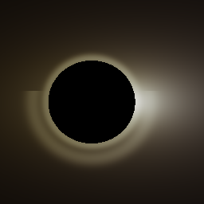
*图 6：fast thin-disk 模型加 bloom + tone mapping 的艺术化渲染。*

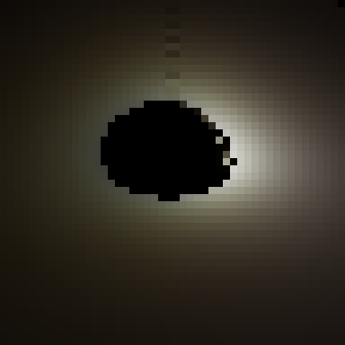
*图 7：参考分辨率（$48 \times 48$）下的 float64 测地线渲染。*


*图 8：$1024 \times 1024$ float64 高分辨率测地线渲染。Kernel 时间约 $3.5$ s，8 GB RTX 4060 不出 OOM。*

### 颜色映射（CIE 1931 + Planck + sRGB）

为了从工程级的近似 RGB 升级到论文级的颜色管线，本项目实现 `src/disk_color.py`：

- **黑体 Planck 谱**：

$$
B_{\lambda}(\lambda, T) = \frac{2 h c^{2}}{\lambda^{5}}\, \frac{1}{\exp\!\left(\dfrac{h c}{\lambda k_{B} T}\right) - 1}
$$

- **CIE 1931 三刺激值**：用 Wyman, Sloan & Shirley (2013) 的多 lobe 高斯拟合 $\bar{x}(\lambda),\, \bar{y}(\lambda),\, \bar{z}(\lambda)$，覆盖 380–780 nm，与表格数据吻合 $< 0.5\%$：

$$
X = \int B_{\lambda}(\lambda, T)\, \bar{x}(\lambda)\, \mathrm{d}\lambda,\qquad
Y = \int B_{\lambda}\, \bar{y}\, \mathrm{d}\lambda,\qquad
Z = \int B_{\lambda}\, \bar{z}\, \mathrm{d}\lambda
$$

- **XYZ → sRGB**：D65 白点下的标准 $3 \times 3$ 矩阵 + IEC 61966-2-1 gamma 编码。
- **Wien 位移**：把红移因子 $g$ 视作 Wien 频率位移，发射温度乘 $g$ 得到观察者侧等效黑体温度 $T_{\mathrm{obs}} = g \cdot T_{\mathrm{em}}$。

Stokes I 渲染时切换 `cfg["render"]["color_mode"] = "cie1931"` 即可启用；保留旧的 `temperature_to_rgb` 经验式作为艺术化预览。对比图见 `figures/cie_vs_approx_comparison.png`。

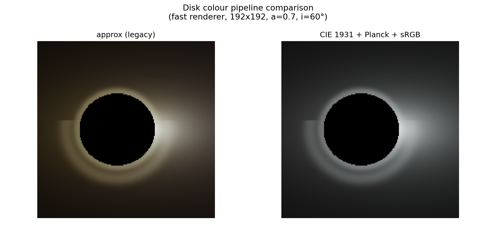
*图 9：左为旧的近似 RGB（艺术化金黄调），右为 CIE 1931 + Planck + sRGB 严格颜色（更接近真实黑体外观）。*

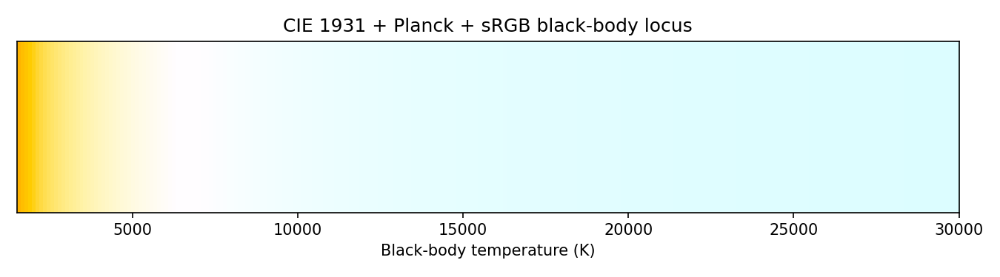
*图 10：从 1500 K 到 30000 K 的 sRGB 黑体色谱。约 5500 K 为白点（太阳色温），>10000 K 偏蓝白，<3500 K 偏橙红。*

## 10. 偏振扩展（stub）

为给 EHT 类偏振成像留出可扩展接口，我们实现 `src/polarization.py`，覆盖：

- **Walker–Penrose 守恒复量**：

$$
\kappa_{\mathrm{WP}} = \kappa_{1} + i\,\kappa_{2} = (A - i B)(r - i a \cos\theta),
$$

其中
$$
A = (p^{t} f^{r} - p^{r} f^{t}) + a \sin^{2}\theta\, (p^{r} f^{\phi} - p^{\phi} f^{r}),
$$
$$
B = \bigl[(r^{2} + a^{2})(p^{\phi} f^{\theta} - p^{\theta} f^{\phi}) - a (p^{t} f^{\theta} - p^{\theta} f^{t})\bigr]\, \sin\theta.
$$
$\kappa_{1}$ 与 $\kappa_{2}$ 沿测地线**独立守恒**，避免显式 parallel-transport ODE。

- **盘 emission frame**：Keplerian fluid + 纯 toroidal 磁场，光学薄 synchrotron 假设线偏振 $\perp$ 投影磁场。
- **Connors–Stark 屏幕投影**：用 Bardeen 不变量 $(\alpha, \beta, \lambda, \mu)$ 从 $\kappa$ 解码观察者 EVPA：

$$
\tan(2 \chi_{\mathrm{obs}}) = \frac{\beta\, \kappa_{2} - \mu\, \kappa_{1}}{\beta\, \kappa_{1} + \mu\, \kappa_{2}}.
$$

- **Stokes 旋转**：从发射 EVPA 旋转到观察者 EVPA，输出 $(I, Q, U)$，$V = 0$（不算圆偏振）：

$$
Q_{\mathrm{obs}} = \Pi\, I\, \cos(2 \chi_{\mathrm{obs}}),\qquad
U_{\mathrm{obs}} = \Pi\, I\, \sin(2 \chi_{\mathrm{obs}}).
$$

48×48 端到端 demo（`tools/polarization_demo.py`）跑出 91.7% disk hit、$\Pi_{\mathrm{obs}} \approx 0.10$。已知 stub 局限：无 Faraday rotation、不沿轨迹积分 radiative transfer、磁场模型纯 toroidal、observer 用 $r \to \infty$ 极限。详见 `docs/polarization.md`。

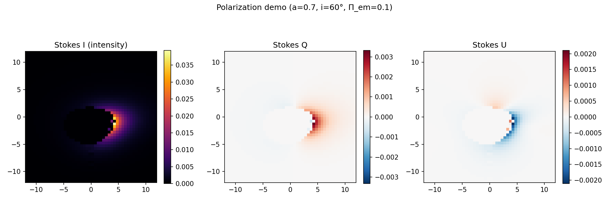
*图 11：$a = 0.7$、$i = 60^{\circ}$ 下的 Stokes I/Q/U 三联图（48×48，$\Pi_{\mathrm{em}} = 0.1$）。*

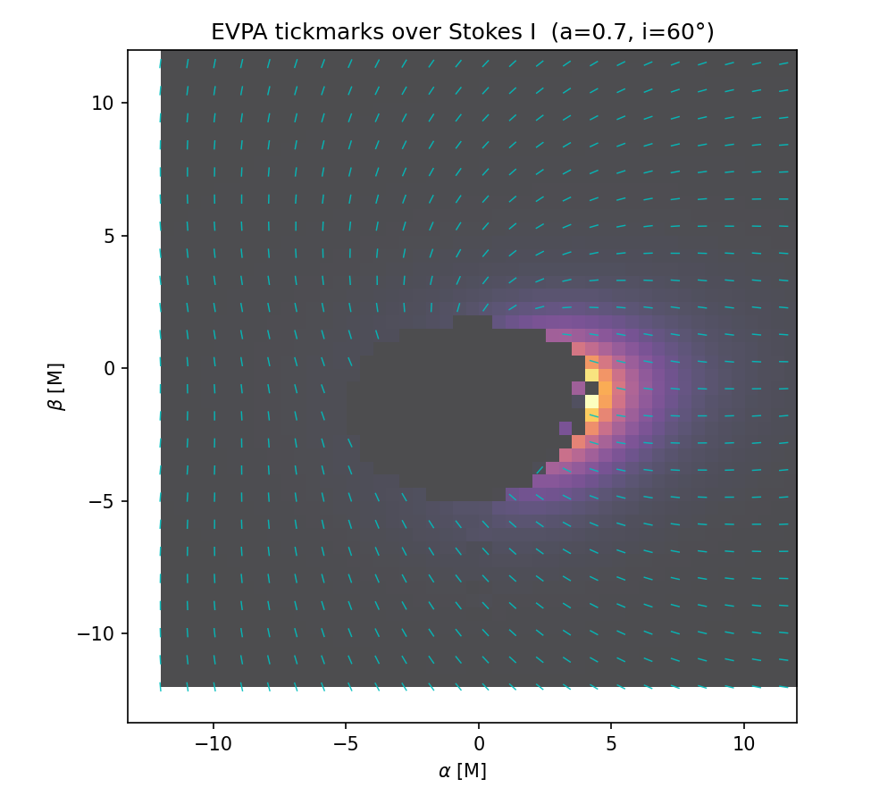
*图 12：在 Stokes I 底图上叠 EVPA tickmark。临界区域的 EVPA pattern 受 Walker–Penrose 投影主导。*

## 11. EHT 风格图像指标

`src/eht_metrics.py` 提供面向 EHT 文献的指标：

- **Ring diameter**：高强度像素（$I \ge 0.5 \cdot I_{\max}$）几何半径中位数的 $2\times$，单位 $M$。
- **Ring asymmetry**：south/north 半屏总通量比。
- **Photon-ring proxy**：径向亮度峰值半径。

在 $a = 0.7$、$i = 60^{\circ}$ 的 float64 参考图上得 ring diameter $\approx 9.7\,M$，asymmetry south/north $\approx 0.66$，photon-ring peak $r \approx 4.6\,M$。换算到 M87*（$M = 6.5 \times 10^{9}\,M_{\odot}$，$D = 16.8$ Mpc，$1\,M \approx 3.83\,\mu\mathrm{as}$）后 ring 直径约 $37\,\mu\mathrm{as}$，与 EHT 的 $42 \pm 3\,\mu\mathrm{as}$ 在物理量级一致；asymmetry 由 Doppler 主导，与真实 EHT $\gtrsim 10\!:\!1$ ratio 不同（后者来自 GRMHD 流动力学，详见 §13 范畴边界讨论）。

24 配置完整指标见 `results/eht_metrics_report.md`：随自旋升高 ring 直径从 $a = 0$ 的 $\sim 20\,M$ 缩小到 $a = 0.998$ 的 $\sim 7\,M$，photon-ring peak 从 $7.4\,M$ 缩到 $3.2\,M$。

## 12. 时间依赖与扩展 stub

`src/grmhd_io.py` 提供 GRMHD HDF5 ingestion 接口（HARM/iharm 风格 `prims` layout 占位）+ 一份解析的 `synthetic_thin_disk_fluid()`，以便 downstream 代码不依赖真实 GRMHD snapshot 也能开发与测试。emission coefficient 给出最简单的 thermal synchrotron 占位实现。

`tools/compose_animations.py` 把 24 张 spin $\times$ inclination 扫描合成 GIF：
- `figures/spin_sweep_animation.gif`（$i = 60^{\circ}$ 固定，6 帧 spin sweep）
- `figures/inclination_sweep_animation.gif`（$a = 0.7$ 固定，4 帧 inclination sweep）
- `figures/full_sweep_animation.gif`（24 帧全组合 raster）

注意这是**参数扫描动画**，不是真正的时间依赖渲染——Kerr 时空本身静态，hot-spot orbit / GRMHD time-evolved 等真正时间依赖留作后续。

`docs/extensions_roadmap.md` 给出多 GPU、可微 ray tracing、神经网络 surrogate、hot-spot 时间依赖动画的接口设计与工作量估计（每条 $1$–$4$ 周）。

## 13. 范畴边界与限制

本项目是 **数值算法验证基线**，**不是 EHT 观测拟合工具**。具体地：

| 维度 | 本项目 | EHT GRMHD + GRRT |
|------|--------|--------------------|
| 几何 | 赤道面 thin disk | 厚 RIAF / MAD / SANE 流体 |
| 流体 | Keplerian 解析速度场 | 完整 GRMHD（含磁场 / 压力 / 加热 / 冷却）|
| 辐射 | 灰体功率律 / NT flux | thermal + non-thermal synchrotron + 自吸收 |
| 偏振 | Walker–Penrose stub | full polarized transfer (Stokes I,Q,U,V) |
| 频率 | 单频灰体 | 多频含吸收 |
| 时间 | 稳态 + 参数扫描 | 动态 snapshot / 时均 |

更详细的对比、M87*/Sgr A* 关键数字对照见 `research/literature_review.md` §6。

## 14. 结论

我们构建了一套可复现、可交叉验证、可加速的 Kerr 薄盘光线追踪系统，CPU/GPU 双后端 + 可选 `float32`/`float64` 精度。`float64` CUDA kernel 在 $48 \times 48$ 验证下与 CPU 参考 status 一致率 99.96%、disk-hit 完全一致；与 `geokerr` 的轨迹级一致率 91%（disk 段超过 98%）。代码同时打包了 Docker/WSL2 支持、47 个 pytest、扩展验证套件、参数扫描、fast math 优化、CIE 1931 颜色、Walker–Penrose 偏振、EHT 风格指标、GRMHD ingestion stub、参数扫描动画。

### 后续工作
- 自适应 RK45 / 嵌入 RK 对在 GPU 上的实现（处理临界 ray + 减少 warp divergence）。
- 完整偏振 radiative transfer（沿测地线积分 + Faraday rotation）。
- GRMHD 时变 ingestion + 与 ipole/grtrans 标准测试问题的逐像素对比。
- 多 GPU 域分解，支持 4K+ 渲染。
- 可微 ray tracing 与神经网络 surrogate（参数推断 / 实时预览）。

---

## 参考文献

1. J. M. Bardeen, W. H. Press, & S. A. Teukolsky, "Rotating Black Holes: Locally Nonrotating Frames, Energy Extraction, and Scalar Synchrotron Radiation," *ApJ* 178, 347 (1972).
2. J. M. Bardeen, "Timelike and null geodesics in the Kerr metric," Les Houches lectures (1973).
3. B. Carter, "Global structure of the Kerr family of gravitational fields," *Phys. Rev.* 174, 1559 (1968).
4. R. Connors & R. F. Stark, "Observable gravitational effects on polarised radiation coming from near a black hole," *Nature* 269, 128 (1977).
5. C. T. Cunningham, "The effects of redshifts and focusing on the line profiles from accretion disks around black holes," *ApJ* 202, 788 (1975).
6. J. Dexter & E. Agol, "A fast new public code for computing photon orbits in a Kerr spacetime," *ApJ* 696, 1616 (2009)——`geokerr`.
7. EHT Collaboration, "First M87 Event Horizon Telescope Results. I. The Shadow of the Supermassive Black Hole," *ApJL* 875, L1 (2019).
8. EHT Collaboration, "First M87 Event Horizon Telescope Results. VI. The Shadow and Mass of the Central Black Hole," *ApJL* 875, L6 (2019).
9. J. Frank, A. King, & D. Raine, *Accretion Power in Astrophysics* (Cambridge, 2002).
10. D. Page & K. Thorne, "Disk-Accretion onto a Black Hole. Time-Averaged Structure of Accretion Disk," *ApJ* 191, 499 (1974).
11. M. Walker & R. Penrose, "On quadratic first integrals of the geodesic equations for type {22} spacetimes," *Commun. Math. Phys.* 18, 265 (1970).
12. C. Wyman, P.-P. Sloan, & P. Shirley, "Simple Analytic Approximations to the CIE XYZ Color Matching Functions," *JCGT* 2(2), 2013.
13. F. Yang & J. Wang, "YNOGK: A new public code for calculating null geodesics in the Kerr spacetime," *ApJS* 207, 6 (2013).

## 附录：复现快速入口

```bash
# CPU 快速预览
python run_cpu.py

# CPU Hamiltonian 测地线（慢，精确）
python run_geodesic_cpu.py

# GPU float64 测地线（快，精确）
python run_geodesic_gpu.py --precision float64

# 全部测试
pytest -q

# 参数扫描
python scripts/run_experiments.py

# 一键完整流水线（含本轮新增 demo）
.\scripts\run_all.ps1            # Windows
./scripts/run_all.sh             # WSL / Linux
```

详细说明见 `README.md`、`docs/`、`tools/README.md`。
